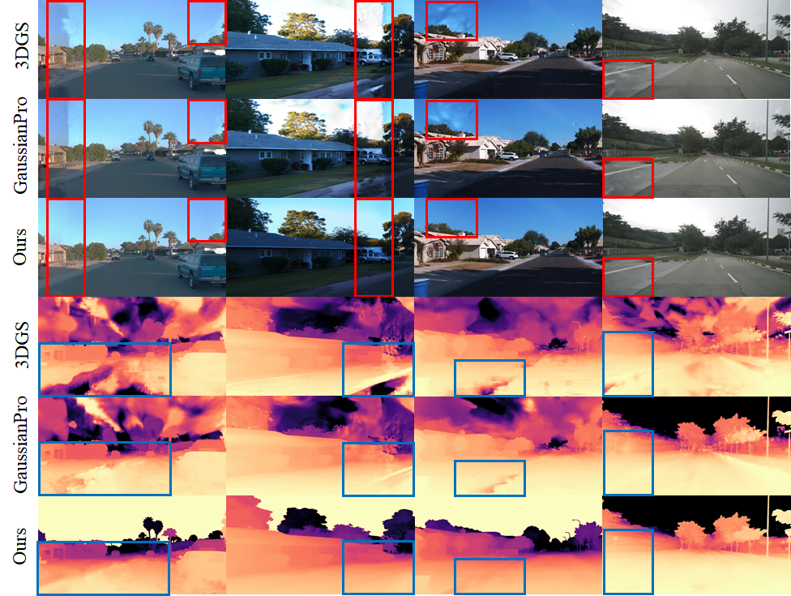
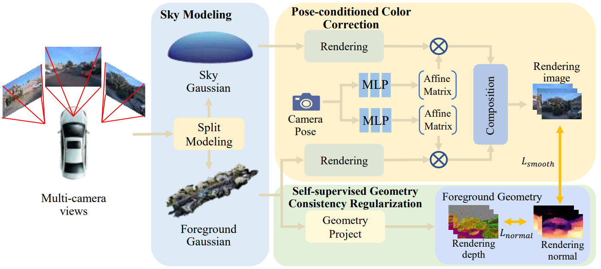

  <h1 align="center">MC-Gaussian: 3D Gaussian Splatting with Multi-camera in Autonomous Driving</h1>

## 🖼️ Demo

 ## 📖 Abstract

Novel view synthesis is crucial in developing closed-loop autonomous driving simulation systems. 
The modern autonomous driving system typically employs multiple
cameras to achieve wide perception, but this also introduces
challenges for neural rendering, i.e., the color inconsistency
among different cameras and the sparse observation in the
side cameras. While NeRF-based methods offer solutions, their
inefficiencies in rendering speed limit practical applications in
simulation. Due to the inherent differences in reconstruction
methods between NeRF and 3DGS, naively transferring NeRF’s
multi-camera solution to 3DGS is ineffective. We propose
MC-Gaussian, a real-time rendering solution for multi-camera
settings based on 3D Gaussian representation. We introduce
separate Gaussian models for the foreground and sky background, applying pose-conditioned color correction respectively
to resolve color inconsistencies from different cameras. Additionally, we introduce the regularization terms of geometric
consistency across cameras to alleviate the overfitting from
sparse view observations. Our method achieves state-of-the-art
results on static scenes from the Waymo and NuScenes datasets,
producing high-fidelity and real-time rendering.

## 🚀 Pipeline

##  📺 Video

The high-definition video of our project presentation is [here](https://youtu.be/JB79gaG0rt4).

## 🚀 Code
The code will be released after paper has been accepted.
